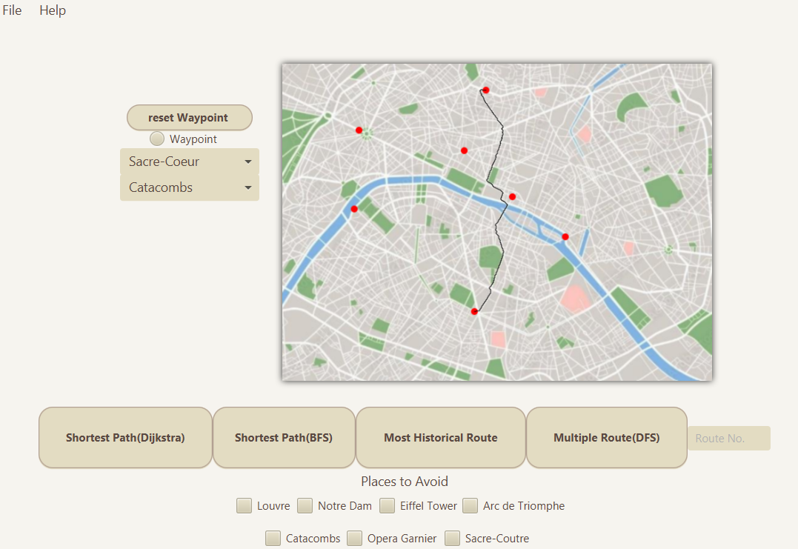

# Paris Route Finder
Paris Route Finder for CA2 of Data Structures &amp; Algorithms 2 (Year 2, Semester 2, 94%)

## Overview
This is a JavaFX application that creates optimal routes between 2 chosen landmarks in Paris.
The core of the path resolutions utilizes graphs and graph nodes (landmarks and junctions) where each node is connected to one or more nodes via edges (streets).
The graph class (ParisMap) uses adjacency matrices to track the the end nodes of each edge and the cost (distance/historical value) of the edge. 




## Features
- **CSV Loading**: Loads in landmark and street data from CSV file (which can be edited).
- **Dijkstra's Shortest Path**: Find the optimal route between 2 landmarks (using pre-loaded coordinates for landmarks and junctions for nodes) using Dijkstra's algorithm.
- **DFS Multiple Routes**: Find multiple routes between 2 landmarks using Depth-First Search.
- **BFS Shortest Path**: Find the optimal route between 2 landmarks (with the pixels of a black and white conversion of the map as nodes) using Breadth-First Search.
- **Most Historical Route**: Find the most historical route between 2 landmarks while also taking distance into consideration (landmarks and junctions near landmarks would be more historical then a junction that's not near a landmark).
- **Avoiding Landmarks**: Tick any landmarks you wish to avoid.
- **Waypoint Functionality**: Click on the map after clicking the waypoint radio button, select "Waypoint" in the choice box and find the path between the waypoint and chosen landmark.
- **JMH Benchmarking**: Benchmark methods within the project.

## Setup
Run this command in the terminal after cloning the repository:
  ```bash
  mvnw clean verify build 
  ```
Make sure to run the Benchmark before the actual application and that it compiles in your software.
